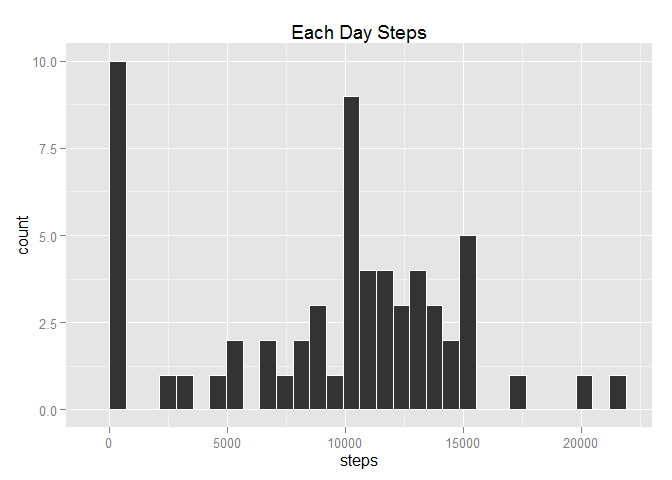
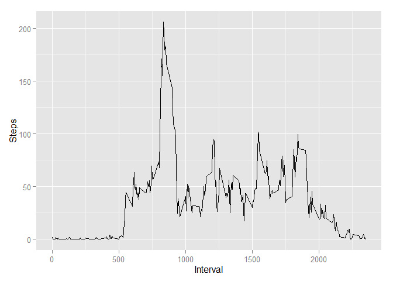
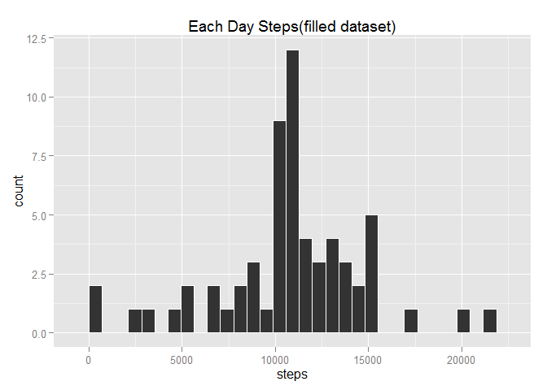
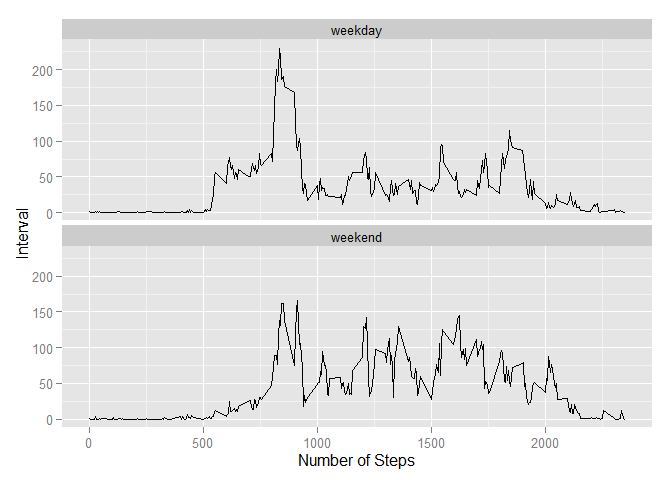

# Reproducible Research: Peer Assessment 1


## Loading and preprocessing the data
Load the data in a data.frame called **dt**; while loading, set correct colClass.

```r
dt <- read.table(file = "activity.csv",header = TRUE,colClasses = c("numeric","Date","numeric"),sep = ",")
```

## What is mean total number of steps taken per day?
1. Use *reshape2* package to calculate the total number of steps taken per day, and store it in a data.frame called **daily_step**.

```r
library(reshape2)
dtmelt <- melt(data = dt,id.vars = 2:3,measure.vars = 1)
daily_step<- dcast(dtmelt, date~variable, sum,na.rm=TRUE)
```
2. Use *ggplot2* package to make a histogram of the total number of steps taken each day.

```r
library(ggplot2)
ggplot(daily_step,aes(steps))+geom_histogram(color="white")+labs(title="Each Day Steps")
```

```
## stat_bin: binwidth defaulted to range/30. Use 'binwidth = x' to adjust this.
```

 
3. Calculate the mean and median of the total number of steps taken per day, and store them in **mean_step** and **median_step**

```r
mean_step <- mean(daily_step$steps,na.rm=TRUE)
median_step <- median(daily_step$steps,na.rm=TRUE)
```
So, the mean of the total number of steps taken per day is 9354.2295082;  
the median of the total number of steps taken per day 1.0395\times 10^{4}.

## What is the average daily activity pattern?
1. Use *tapply* to calculate the average number of steps taken. Plot it with *qplot*.

```r
interval_step <- tapply(dt$steps,dt$interval,FUN = mean,na.rm=TRUE)
qplot(unique(dt$interval),interval_step,geom = "line")+labs(x="Interval",y="Steps")
```

 
2. *Which.max* can return the maximum number of average steps across all the days.

```r
max_inter <- unique(dt$interval)[which.max(interval_step)]
```
So, we can konw that, the interval with the maximum number of average steps is 835.

## Imputing missing values
1. Use *is.na* to calculate the number of missing values.

```r
na_num <- sum(is.na(dt$steps))
```
There are 2304 missing values.  
2. Fill in the missing values using the mean for that 5-minute interval. Store filled dataset in a data.frame called **dt_filled**

```r
dt_filled <- cbind(dt,fill=rep(interval_step,61))
dt_filled$steps[is.na(dt_filled$steps)] <- dt_filled$fill[is.na(dt_filled$steps)]
dt_filled <- dt_filled[,1:3]
```
3. Use *ggplot2* package to make the histogram of filled dataset.

```r
dtfillmelt <- melt(data = dt_filled,id.vars = 2:3,measure.vars = 1)
daily_fill_step<- dcast(dtfillmelt, date~variable, sum,na.rm=TRUE)
ggplot(daily_fill_step,aes(steps))+geom_histogram(color="white")+labs(title="Each Day Steps(filled dataset)")
```

```
## stat_bin: binwidth defaulted to range/30. Use 'binwidth = x' to adjust this.
```

 
Calculate the mean and median total number of steps taken per day.

```r
mean_fill_step <- mean(daily_fill_step$steps,na.rm=TRUE)
median_fill_step <- median(daily_fill_step$steps,na.rm=TRUE)
```
These values (mean:1.0766189\times 10^{4}; median:1.0766189\times 10^{4}) differ from the estimates from the first part of the assignment. Imputing missing data increases estimates of the total daily number of steps.

## Are there differences in activity patterns between weekdays and weekends?
1. Use *weekdays* to indicate whether a day is weekday or weekend. Store this factor in **dt_filled**.

```r
week <- weekdays(dt_filled$date) %in% c("星期六","星期日")
week <- factor(week)
levels(week) <- c("weekday","weekend")
dt_filled <- cbind(dt_filled,week)
```
2.Use *tapply* to calculate average steps across interval and week. And make a figure with *ggplot2*.

```r
week_step <- tapply(dt_filled$steps,list(dt_filled$interval,dt_filled$week),mean,na.rm=TRUE)
week_step <- melt(data = week_step,varnames = c("interval","week"),value.name = "step")
ggplot(week_step,aes(interval,step))+geom_line()+facet_wrap(facets = ~week,nrow=2)+labs(x="Number of Steps",y="Interval")
```

 
From the figures, we can konw there **are** differences in activity patterns between weekdays and weekends. In weekdays, a lot of steps are taken in morning. However, in weekend, steps are taken more balance across time.
